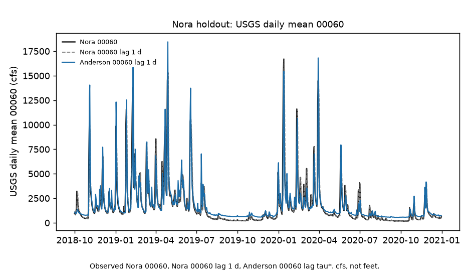
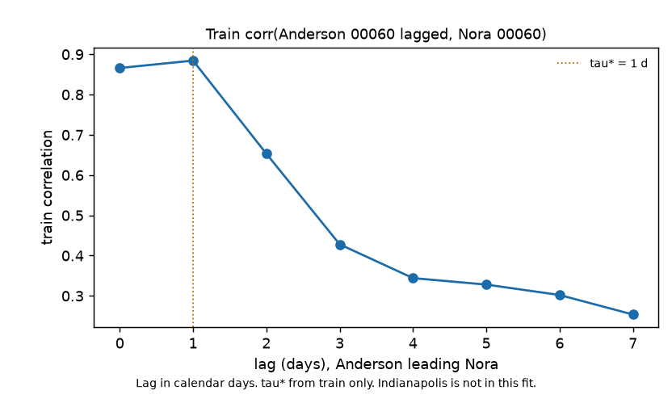

# White River Anderson → Nora Q

Does lagged USGS daily mean 00060 at Anderson beat lag-1 USGS daily mean 00060 at Nora?

Yes, on the 2018-10-01 to 2020-12-31 holdout. The best train lag is 1 calendar day. Scaled Anderson daily mean 00060 (lag 1 d) has holdout RMSE **971 cfs**. Nora daily mean 00060 from the previous calendar day has RMSE **1,243 cfs**. NOAA National Water Model v2.1 retrospective streamflow at the Nora reach, compared to the same Nora 00060 series on this split, has RMSE **1,316 cfs** (that number is copied from the NWM-error live report, not recomputed here). Anderson 00060 at lag 1 d is the best of the three. The operational routed model left skill that USGS 03348000 already had. This tree does not read `p_sfha` and does not paint HAND.

## What was compared

White River, Indiana, upstream to downstream:

| USGS site | Official name | Role |
|-----------|---------------|------|
| 03348000 | White River at Anderson, IN | Feature: daily mean discharge parameter **00060**, lagged 0 to 7 calendar days |
| 03351000 | White River near Nora, IN | Label: daily mean discharge **00060** on day t |
| 03353000 | White River at Indianapolis, IN | Diagnostic only. Downstream of Nora. Not a feature. |

00060 is USGS daily mean discharge in cubic feet per second. The label is not gage height 00065 and is not converted to feet.

On training days through 2018-09-30, tau* is the lag in {0,1,...,7} that maximizes Pearson correlation between Anderson 00060 lagged tau calendar days and Nora 00060 on that day. That lag is frozen. A one-coefficient line (scale 2.30, intercept 390 cfs) is fit on train: predicted Nora 00060 = 2.30 * Anderson 00060(lag tau*) + 390. Holdout scores that prediction against:

- Nora 00060 lag 1 calendar day: the previous day's daily mean at the same gage
- NWM v2.1 retrospective streamflow at NHDPlus COMID 18476353 (Nora), noon UTC, converted to cfs, versus USGS daily mean 00060, holdout RMSE 1,316 cfs from the already-published NWM-error run (commit fa2e315). This repo does not download NWM again.

Train n is the valid days 2016-10-01 through 2018-09-30. Holdout is 2018-10-01 through 2020-12-31 (823 days). There is no August 2026 overlay.

## Why this comparison exists

On the same split, NWM v2.1 beat Nora 00060(t−1) only at Anderson (RMSE 488 vs 676 cfs). At Nora, Indianapolis, and Centerton, Nora/local 00060(t−1) won and NWM ran high (bias +70, +319, +483 cfs). That pattern is extra water entering below Anderson (Fall Creek, reservoirs, local runoff), not a statement that NWM fails at every gage. This repo asks whether Anderson 00060, lagged, already captures what NWM missed at Nora.

Anderson lag 1 d RMSE is 971 cfs, below Nora lag 1 d (1,243) and below NWM (1,316).

Indianapolis 00060 is correlated 0.99 with same-day Nora 00060 on train. That is a downstream diagnostic. Using Indianapolis 00060 to predict Nora 00060 would leak the lower river into the target.



Figure 1. USGS daily mean 00060 at Nora (black), Nora 00060 lag 1 d (dashed), Anderson 00060 lag 1 d scaled on train (blue). Units cfs.



Figure 2. Train Pearson corr of Anderson 00060 lagged 0 to 7 days versus Nora 00060 on day t. tau* = 1 d marked. Calendar-day travel between gages, not a wet mask.

## Live skill (holdout 2018-10-01 to 2020-12-31)

| Predictor of Nora 00060 on day t | RMSE (cfs) | MAE (cfs) |
|---------------------------------|-----------:|----------:|
| Nora 00060 lag 1 calendar day | 1,243 | 549 |
| 2.30 * Anderson 00060 lag 1 d + 390 | 971 | 531 |
| NWM v2.1 at Nora COMID (cited fa2e315) | 1,316 | n/a |

Caveats (none reverse the ranking): the scale 2.30 mixes travel time with drainage-area; both series are daily mean 00060, not hourly; NWM column is noon UTC vs daily mean; no 2026 dates.

## Stage 0

Synthetic Anderson 00060 routed to Nora at lag 2 so CI recovers τ* without NWIS. Fixture under `logs/stage0_fixture/`.

```bash
python3.12 -m venv .venv
source .venv/bin/activate
pip install -r requirements.txt
PYTHONPATH=src:. python3 scripts/run_fixture.py logs/stage0_fixture
.venv/bin/python -m pytest tests -q
PYTHONPATH=src:. python3 scripts/run_live.py logs/nora_live
```

Two figures max. Empty NWIS 00060 stops (`run_live.py` exit 2).

| File | Role |
|------|------|
| [METHODOLOGY.md](METHODOLOGY.md) | Locked contract |
| [AGENTS.md](AGENTS.md) | Agent rules |
| [CHECKLIST.md](CHECKLIST.md) | Operator list |
| `src/upq/` | NWIS 00060, τ*, skill, figures |
| `upqforge/` | GraphForge pin |
